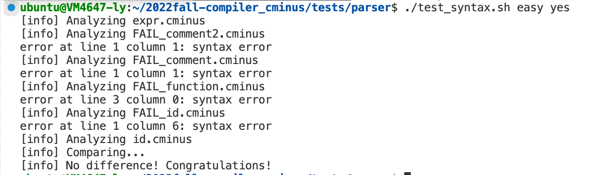
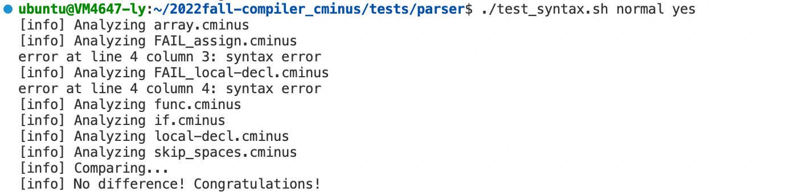
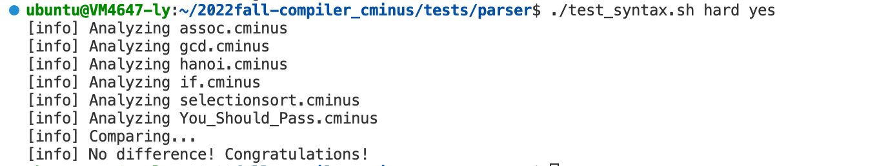

# lab1 实验报告
学号 PB20000114 姓名 刘阳

## 实验要求
完成一个完整的 Cminus-f 解析器，包括基于 `flex` 的词法分析器和基于 `bison` 的语法分析器。

## 实验难点
+ 词法分析器设计时对注释的正则匹配较为复杂
+ 词法分析的匹配规则需要注意顺序
+ 需要处理空格,tab和换行
## 实验设计
###lexer
词法分析部分比较简单,根据关键字书写正则表达式,同时注意匹配顺序(例:浮点数和整数),并输出对应token,即可.

###parser
定义好类型后根据文档中的语法规则书写语法树构造规则
## 实验结果验证
脚本测试:
easy:



normal:



hard:


自行设计测试样例:
```c
/*
adasdsadasdad
awdqw
    */
void test(void)
{
    /*sda*/
}
int main(void)
{
    test();
    return 0;
}
```
```bash
>--+ program
|  >--+ declaration-list
|  |  >--+ declaration-list
|  |  |  >--+ declaration
|  |  |  |  >--+ fun-declaration
|  |  |  |  |  >--+ type-specifier
|  |  |  |  |  |  >--* void
|  |  |  |  |  >--* test
|  |  |  |  |  >--* (
|  |  |  |  |  >--+ params
|  |  |  |  |  |  >--* void
|  |  |  |  |  >--* )
|  |  |  |  |  >--+ compound-stmt
|  |  |  |  |  |  >--* {
|  |  |  |  |  |  >--+ local-declarations
|  |  |  |  |  |  |  >--* epsilon
|  |  |  |  |  |  >--+ statement-list
|  |  |  |  |  |  |  >--* epsilon
|  |  |  |  |  |  >--* }
|  |  >--+ declaration
|  |  |  >--+ fun-declaration
|  |  |  |  >--+ type-specifier
|  |  |  |  |  >--* int
|  |  |  |  >--* main
|  |  |  |  >--* (
|  |  |  |  >--+ params
|  |  |  |  |  >--* void
|  |  |  |  >--* )
|  |  |  |  >--+ compound-stmt
|  |  |  |  |  >--* {
|  |  |  |  |  >--+ local-declarations
|  |  |  |  |  |  >--* epsilon
|  |  |  |  |  >--+ statement-list
|  |  |  |  |  |  >--+ statement-list
|  |  |  |  |  |  |  >--+ statement-list
|  |  |  |  |  |  |  |  >--* epsilon
|  |  |  |  |  |  |  >--+ statement
|  |  |  |  |  |  |  |  >--+ expression-stmt
|  |  |  |  |  |  |  |  |  >--+ expression
|  |  |  |  |  |  |  |  |  |  >--+ simple-expression
|  |  |  |  |  |  |  |  |  |  |  >--+ additive-expression
|  |  |  |  |  |  |  |  |  |  |  |  >--+ term
|  |  |  |  |  |  |  |  |  |  |  |  |  >--+ factor
|  |  |  |  |  |  |  |  |  |  |  |  |  |  >--+ call
|  |  |  |  |  |  |  |  |  |  |  |  |  |  |  >--* test
|  |  |  |  |  |  |  |  |  |  |  |  |  |  |  >--* (
|  |  |  |  |  |  |  |  |  |  |  |  |  |  |  >--+ args
|  |  |  |  |  |  |  |  |  |  |  |  |  |  |  |  >--* epsilon
|  |  |  |  |  |  |  |  |  |  |  |  |  |  |  >--* )
|  |  |  |  |  |  |  |  |  >--* ;
|  |  |  |  |  |  >--+ statement
|  |  |  |  |  |  |  >--+ return-stmt
|  |  |  |  |  |  |  |  >--* return
|  |  |  |  |  |  |  |  >--+ expression
|  |  |  |  |  |  |  |  |  >--+ simple-expression
|  |  |  |  |  |  |  |  |  |  >--+ additive-expression
|  |  |  |  |  |  |  |  |  |  |  >--+ term
|  |  |  |  |  |  |  |  |  |  |  |  >--+ factor
|  |  |  |  |  |  |  |  |  |  |  |  |  >--+ integer
|  |  |  |  |  |  |  |  |  |  |  |  |  |  >--* 0
|  |  |  |  |  |  |  |  >--* ;
|  |  |  |  |  >--* }
```

## 实验反馈
+ 希望能增加词法分析完成后的单独测试工具,这样在完成词法分析器完成后可以单独进行测试,或者说明如何单独测试词法分析器.