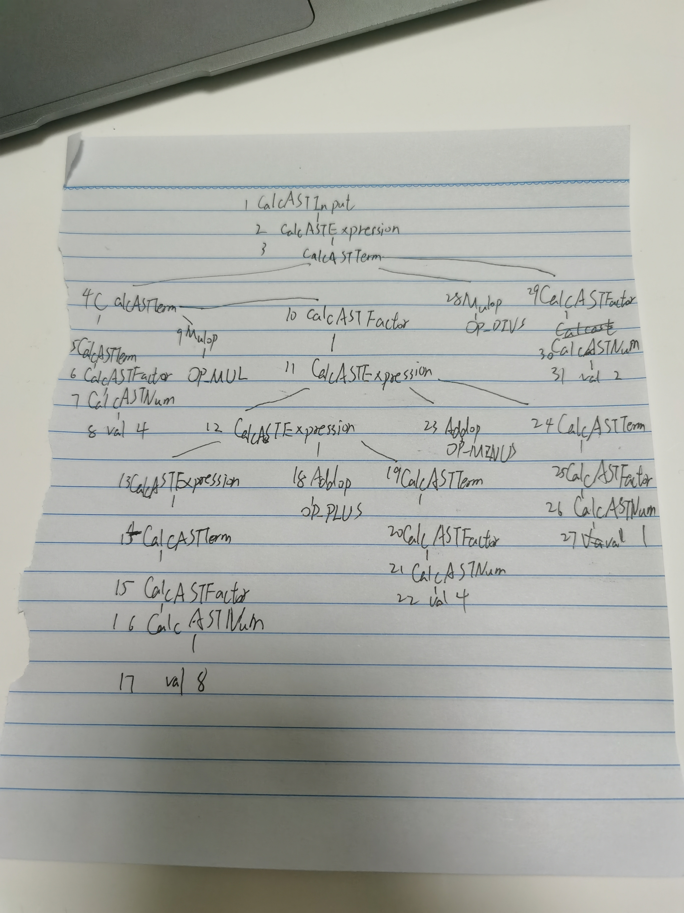

# lab2 实验报告
PB20000114 刘阳

## 问题1: getelementptr
请给出 `IR.md` 中提到的两种 getelementptr 用法的区别,并稍加解释:
  - `%2 = getelementptr [10 x i32], [10 x i32]* %1, i32 0, i32 %0`
  - `%2 = getelementptr i32, i32* %1 i32 %0`
第一种写法返回一个指向%1指向数组的第0个元素的第0个段的指针,不过该数组由i32组成,每个元素只有一个段,因此若只提供一个偏移,则返回类型是[10 x i32]*.
第二个写法返回%1偏移0后的指针.
## 问题2: cpp 与 .ll 的对应
请说明你的 cpp 代码片段和 .ll 的每个 BasicBlock 的对应关系。
### assign
<!-- <details> -->

```c++
#include "BasicBlock.h"
#include "Constant.h"
#include "Function.h"
#include "IRBuilder.h"
#include "Module.h"
#include "Type.h"
#include <iostream>
#include <memory>

#ifdef DEBUG // 用于调试信息,大家可以在编译过程中通过" -DDEBUG"来开启这一选项
#define DEBUG_OUTPUT std::cout << __LINE__ << std::endl; // 输出行号的简单示例
#else
#define DEBUG_OUTPUT
#endif

#define CONST_INT(num) ConstantInt::get(num, module)

#define CONST_FP(num) ConstantFP::get(num, module) // 得到常数值的表示,方便后面多次用到

int main() {
    auto module = new Module("Cminus code");  // module name是什么无关紧要
    auto builder = new IRBuilder(nullptr, module);
    Type *Int32Type = Type::get_int32_type(module);


    auto mainFun = Function::create(FunctionType::get(Int32Type, {}),
                                  "main", module);
    auto bb = BasicBlock::create(module, "entry", mainFun);
    builder->set_insert_point(bb);

    auto retAlloca = builder->create_alloca(Int32Type);
    builder->create_store(CONST_INT(0), retAlloca);

    auto arrayType = ArrayType::get(Int32Type,10);
    auto a=builder->create_alloca(arrayType);

    auto a0GEP = builder->create_gep(a, {CONST_INT(0), CONST_INT(0)});
    builder->create_store(CONST_INT(10),a0GEP);
    auto tmp=builder->create_load(a0GEP);
    auto ans=builder->create_imul(tmp, CONST_INT(2));
    auto a1GEP=builder->create_gep(a,{CONST_INT(0), CONST_INT(1)});
    builder->create_store(ans,a1GEP);

//    builder->create_store(ans,retAlloca);

//    auto retdata=builder->create_load(retAlloca);
    builder->create_ret(ans);


    std::cout << module->print();
    delete module;
    return 0;
}

```
```llvm
define i32 @main() {
label_entry:
  %op0 = alloca i32
  store i32 0, i32* %op0
  %op1 = alloca [10 x i32]
  %op2 = getelementptr [10 x i32], [10 x i32]* %op1, i32 0, i32 0
  store i32 10, i32* %op2
  %op3 = load i32, i32* %op2
  %op4 = mul i32 %op3, 2
  %op5 = getelementptr [10 x i32], [10 x i32]* %op1, i32 0, i32 1
  store i32 %op4, i32* %op5
  ret i32 %op4
}
```
<!-- </details> -->
一个代码块,'auto bb = BasicBlock::create(module, "entry", mainFun);'对应label_entry
### if
<!-- <details> -->

```c++
#include "BasicBlock.h"
#include "Constant.h"
#include "Function.h"
#include "IRBuilder.h"
#include "Module.h"
#include "Type.h"

#include <iostream>
#include <memory>

#ifdef DEBUG // 用于调试信息,大家可以在编译过程中通过" -DDEBUG"来开启这一选项
#define DEBUG_OUTPUT std::cout << __LINE__ << std::endl; // 输出行号的简单示例
#else
#define DEBUG_OUTPUT
#endif

#define CONST_INT(num) ConstantInt::get(num, module)

#define CONST_FP(num) ConstantFP::get(num, module) // 得到常数值的表示,方便后面多次用到

int main() {
    auto module = new Module("Cminus code");  // module name是什么无关紧要
    auto builder = new IRBuilder(nullptr, module);
    Type *Int32Type = Type::get_int32_type(module);
    Type *FloatType = Type::get_float_type(module);

    auto mainFun = Function::create(FunctionType::get(Int32Type, {}),
                                    "main", module);
    auto bb = BasicBlock::create(module, "entry", mainFun);
    builder->set_insert_point(bb);

    auto retAlloca = builder->create_alloca(Int32Type);
    builder->create_store(CONST_INT(0), retAlloca);

    auto a=builder->create_alloca(FloatType);
    builder->create_store(CONST_FP(5.55),a);

    auto retTrue =BasicBlock::create(module,"True",mainFun);

    auto retFalse=BasicBlock::create(module,"False",mainFun);


    auto aValue=builder->create_load(a);
    auto res=builder->create_fcmp_gt(aValue, CONST_FP(1));

    auto br=builder->create_cond_br(res,retTrue,retFalse);

    builder->set_insert_point(retTrue);
    builder->create_store(CONST_INT(233),retAlloca);
    auto ans1=builder->create_load(retAlloca);
    builder->create_ret(ans1);
    builder->set_insert_point(retFalse);
    builder->create_store(CONST_INT(0),retAlloca);
    auto ans2=builder->create_load(retAlloca);
    builder->create_ret(ans2);

    std::cout << module->print();
    delete module;
    return 0;
}
```
```llvm
define i32 @main() {
label_entry:
  %op0 = alloca i32
  store i32 0, i32* %op0
  %op1 = alloca float
  store float 0x4016333340000000, float* %op1
  %op2 = load float, float* %op1
  %op3 = fcmp ugt float %op2,0x3ff0000000000000
  br i1 %op3, label %label_True, label %label_False
label_True:                                                ; preds = %label_entry
  store i32 233, i32* %op0
  %op4 = load i32, i32* %op0
  ret i32 %op4
label_False:                                                ; preds = %label_entry
  store i32 0, i32* %op0
  %op5 = load i32, i32* %op0
  ret i32 %op5
}
```
<!-- </details> -->
三个代码块,'auto bb = BasicBlock::create(module, "entry", mainFun);'对应lable_entry,'auto retTrue =BasicBlock::create(module,"True",mainFun);'对应lable_True,'auto retFalse=BasicBlock::create(module,"False",mainFun);'对应lable_False.
### while
<!-- <details> -->

```c++
#include "BasicBlock.h"
#include "Constant.h"
#include "Function.h"
#include "IRBuilder.h"
#include "Module.h"
#include "Type.h"

#include <iostream>
#include <memory>

#ifdef DEBUG // 用于调试信息,大家可以在编译过程中通过" -DDEBUG"来开启这一选项
#define DEBUG_OUTPUT std::cout << __LINE__ << std::endl; // 输出行号的简单示例
#else
#define DEBUG_OUTPUT
#endif

#define CONST_INT(num) ConstantInt::get(num, module)

#define CONST_FP(num) ConstantFP::get(num, module) // 得到常数值的表示,方便后面多次用到

int main() {
    auto module = new Module("Cminus code");  // module name是什么无关紧要
    auto builder = new IRBuilder(nullptr, module);
    Type *Int32Type = Type::get_int32_type(module);
    Type *FloatType = Type::get_float_type(module);

    auto mainFun = Function::create(FunctionType::get(Int32Type, {}),
                                    "main", module);
    auto bb = BasicBlock::create(module, "entry", mainFun);
    builder->set_insert_point(bb);

    auto retAlloca = builder->create_alloca(Int32Type);
    builder->create_store(CONST_INT(0), retAlloca);

    auto a=builder->create_alloca(Int32Type);
    auto i=builder->create_alloca(Int32Type);
    builder->create_store(CONST_INT(10),a);
    builder->create_store(CONST_INT(0),i);

    auto whileBB=BasicBlock::create(module,"while",mainFun);
    auto retBB=BasicBlock::create(module,"return",mainFun);
    auto iLoad=builder->create_load(i);
    auto com=builder->create_icmp_lt(iLoad, CONST_INT(10));
    auto br=builder->create_cond_br(com,whileBB,retBB);

    builder->set_insert_point(whileBB);
    auto iValue=builder->create_load(i);
    auto addValue=builder->create_iadd(iValue, CONST_INT(1));
    builder->create_store(addValue,i);
    auto Avalue=builder->create_load(a);
    auto addA=builder->create_iadd(addValue,Avalue);
    builder->create_store(addA,a);
    auto judge=builder->create_icmp_lt(addValue, CONST_INT(10));
    auto whileBR=builder->create_cond_br(judge,whileBB,retBB);

    builder->set_insert_point(retBB);
    auto aAns=builder->create_load(a);
    builder->create_ret(aAns);

    std::cout << module->print();
    delete module;
    return 0;
}

```
```llvm
define i32 @main() {
label_entry:
  %op0 = alloca i32
  store i32 0, i32* %op0
  %op1 = alloca i32
  %op2 = alloca i32
  store i32 10, i32* %op1
  store i32 0, i32* %op2
  %op3 = load i32, i32* %op2
  %op4 = icmp slt i32 %op3, 10
  br i1 %op4, label %label_while, label %label_return
label_while:                                                ; preds = %label_entry, %label_while
  %op5 = load i32, i32* %op2
  %op6 = add i32 %op5, 1
  store i32 %op6, i32* %op2
  %op7 = load i32, i32* %op1
  %op8 = add i32 %op6, %op7
  store i32 %op8, i32* %op1
  %op9 = icmp slt i32 %op6, 10
  br i1 %op9, label %label_while, label %label_return
label_return:                                                ; preds = %label_entry, %label_while
  %op10 = load i32, i32* %op1
  ret i32 %op10
}
```
<!-- </details> -->
三个代码块,‘auto bb = BasicBlock::create(module, "entry", mainFun);’对应lable_entry,'auto whileBB=BasicBlock::create(module,"while",mainFun);'对应lable_while,'auto retBB=BasicBlock::create(module,"return",mainFun);'对应lable_return.
### fun
<!-- <details> -->

```c++
#include "BasicBlock.h"
#include "Constant.h"
#include "Function.h"
#include "IRBuilder.h"
#include "Module.h"
#include "Type.h"

#include <iostream>
#include <memory>

#ifdef DEBUG // 用于调试信息,大家可以在编译过程中通过" -DDEBUG"来开启这一选项
#define DEBUG_OUTPUT std::cout << __LINE__ << std::endl; // 输出行号的简单示例
#else
#define DEBUG_OUTPUT
#endif

#define CONST_INT(num) ConstantInt::get(num, module)

#define CONST_FP(num) ConstantFP::get(num, module) // 得到常数值的表示,方便后面多次用到

int main() {
    auto module = new Module("Cminus code");  // module name是什么无关紧要
    auto builder = new IRBuilder(nullptr, module);
    Type *Int32Type = Type::get_int32_type(module);

    auto callee=Function::create(FunctionType::get(Int32Type,{Int32Type}),"callee",module);
    auto bb = BasicBlock::create(module, "entry", callee);
    builder->set_insert_point(bb);                        // 一个BB的开始,将当前插入指令点的位置设在bb
    auto retAlloca = builder->create_alloca(Int32Type);   // 在内存中分配返回值的位置
    auto aAlloca = builder->create_alloca(Int32Type);
    std::vector<Value *> args;
    for (auto arg :callee->get_args()) {
        args.push_back(arg);
    }

    builder->create_store(args[0], aAlloca);
    auto retValue=builder->create_imul(args[0], CONST_INT(2));
    builder->create_store(retValue,retAlloca);
    auto ans=builder->create_load(retAlloca);
    builder->create_ret(ans);

    auto mainFun = Function::create(FunctionType::get(Int32Type, {}),
                                    "main", module);
    auto BB=BasicBlock::create(module,"start",mainFun);
    builder->set_insert_point(BB);
//    auto value=builder->create_alloca(Int32Type);
//    builder->create_store(CONST_INT(110),value);
    auto call=builder->create_call(callee,{CONST_INT(110)});
    builder->create_ret(call);

    std::cout << module->print();
    delete module;
    return 0;
}

```
```llvm
define i32 @callee(i32 %arg0) {
label_entry:
  %op1 = alloca i32
  %op2 = alloca i32
  store i32 %arg0, i32* %op2
  %op3 = mul i32 %arg0, 2
  store i32 %op3, i32* %op1
  %op4 = load i32, i32* %op1
  ret i32 %op4
}
define i32 @main() {
label_start:
  %op0 = call i32 @callee(i32 110)
  ret i32 %op0
}
```
<!-- </details> -->
两个代码块,‘auto bb = BasicBlock::create(module, "entry", callee);'对应lable_entry,'auto BB=BasicBlock::create(module,"start",mainFun);'对应lable_start.
## 问题3: Visitor Pattern
分析 `calc` 程序在输入为 `4 * (8 + 4 - 1) / 2` 时的行为：
1. 请画出该表达式对应的抽象语法树（使用 `calc_ast.hpp` 中的 `CalcAST*` 类型和在该类型中存储的值来表示），并给节点使用数字编号。
2. 请指出示例代码在用访问者模式遍历该语法树时的遍历顺序。

序列请按如下格式指明（序号为问题 3.1 中的编号）：  
3->2->5->1


1->2->3->4->5->6->7->8->9->10->11->12->13->14->15->16->17->18->19->20->21->22->23->24->25->26->27->28->29->30->31
## 实验难点
描述在实验中遇到的问题、分析和解决方案。
ll和cpp中对数组操作的写法感到很迷惑,在利用llvm生成代码后再搜索方才解决.

## 实验反馈
gcd的示例代码感觉参考价值不足,特别对于getelementptr的使用,如果能有不同代码(如全局与局部数组,基本类型与结构体数组)之类的对比可能能更好起到指导和参考作用.
代码框架为什么是2空格缩进.